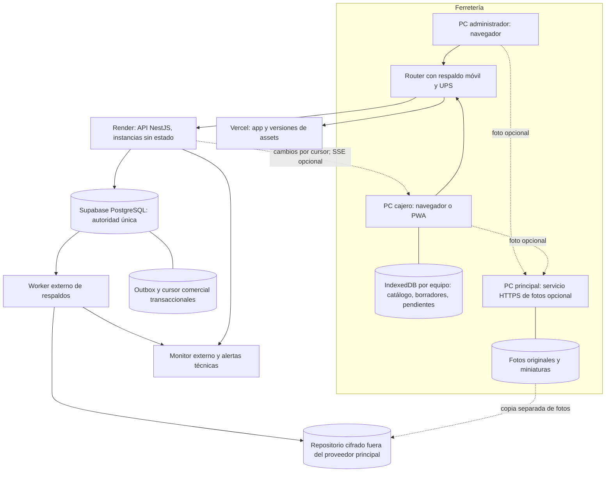

# FerreSystem: continuidad operativa y sincronización

**Estado: propuesta para revisión; ninguna implementación autorizada por este documento.**

Fecha: 10 de octubre de 2026, America/Tegucigalpa. Base auditada: `5eae989dfab0ea04cc6861406ec30df459ae16c2` de `origin/main`. Rama documental: `codex/docs-alta-disponibilidad`, checkout independiente. Al iniciar: checkout principal limpio en `main`; `git fetch --all --prune`; PR abierto #122 (`fix/qa-clientes-cajero`), relacionado con Claude. Las ramas remotas no muestran todo su trabajo local. No se modifican Clientes, POS, permisos, backend, esquema ni configuración de despliegue.

## 1. Decisión recomendada y límites

Mantener **PostgreSQL cloud como autoridad única de ventas, caja, crédito e inventario**. El equipo principal será exclusivamente un servicio opcional de fotografías. Si se apaga, las otras cajas con internet deben seguir vendiendo sin fotos. No instalar una segunda base de ventas activa en ese equipo ni alternar automáticamente entre dos bases independientes.

Primero: recuperación segura, actualización automática del catálogo, validación explícita del importe y respaldos verificados. Después: aplicación instalable con catálogo de consulta y borradores sin conexión. **En ese primer modo offline no se cobra ni se entrega mercancía.** Un eventual modo de ventas en efectivo sin internet requiere otra fase y controles adicionales (§7).

No se promete pérdida cero ante cualquier apagón: el navegador puede perder datos, un equipo puede destruirse y una copia tiene un punto de recuperación limitado. Una respuesta perdida tampoco demuestra que una venta falló. La continuidad combina transacciones, recuperación por identidad, energía/red redundantes y procedimientos de conciliación.

## 2. Auditoría basada en código

Las referencias relativas corresponden a la base indicada; los nombres de función permiten localizar evidencia aunque cambien las líneas. El despliegue Vercel/Render/Supabase es contexto proporcionado por el usuario, **no inventario verificado de infraestructura**. No se consultaron credenciales, datos productivos, paneles de proveedores ni planes contratados.

| Pregunta | Evidencia y comportamiento actual | Límite |
|---|---|---|
| ¿Qué ocurre sin internet? | [POSPage](../frontend/src/pages/POSPage.tsx), `fetchProductos`, `handleCobrar`: catálogo en estado React; GET comercial al montar/cambiar identidad y después de venta exitosa. POST necesita API. Un carrito cargado puede seguir editándose y autoguardarse. | No hay confirmación offline. Tras recarga el catálogo puede no cargar; ni siquiera el arranque está garantizado. No se encontró registro de service worker, IndexedDB ni caché offline en `src`, `public` o [Vite](../frontend/vite.config.ts). |
| ¿Qué pasa al apagar la PC principal? | [productos.service](../backend/src/productos/productos.service.ts), `imagenUrl`, y POS ``: solo referencia URL; no servicio local de fotos implementado. El flujo de venta no espera la imagen. | En la topología cloud indicada, otras PCs con internet conservan API; la foto alojada en esa PC fallaría. POS no tiene fallback explícito de error de foto. Si esa PC comparte internet/DNS, el efecto sería mayor: verificar red real. |
| ¿Qué guarda el navegador? | [posRecovery](../frontend/src/utils/posRecovery.ts), `saveDraft/readRecovery`, y POS: `ferre_sale_draft:<tenant>:<usuario>` y `ferre_pending_sale:<tenant>:<usuario>`. Borrador con versión 1 y `savedAt`; pendiente con UUID. | Guarda líneas (id, código, nombre, cantidad, precio, venta sin inventario/proveedor), nombre/RTN/id cliente, vencimiento, método y descuento. No guarda catálogo completo ni libro durable de todas las ventas. Un slot por usuario/empresa/origen, compartido entre pestañas; no entre PCs. |
| ¿Qué otros datos locales usa POS? | [TenantContext](../frontend/src/context/TenantContext.tsx), [authInterceptors](../frontend/src/utils/authInterceptors.ts): token de acceso, usuario, empresa y contexto de soporte en localStorage; refresh por cookie HttpOnly del backend. | Preferencias y notificaciones locales no acreditan autorización. No almacenar tarjetas ni credenciales de base en el navegador. Autoguardado React no garantiza que el último carácter llegue a disco antes de cortar energía. |
| ¿Cómo cambian precios/existencias? | POS copia precio al agregar línea. Botón «Actualizar catálogo y precios del carrito» reemplaza precios del carrito tras GET. [ProductosService.comercial](../backend/src/productos/productos.service.ts) devuelve `stockActual` comercial = físico menos reservado, y `stockFisico` separado. | No hay sondeo periódico/push de catálogo. Actualizar listado no actualiza automáticamente el carrito. Ese botón necesita comparación y aceptación explícita del cambio; hoy no ofrece desglose previo. |
| ¿Qué valida el servidor? | [VentasService.create](../backend/src/ventas/ventas.service.ts): transacción de 30 s, `lockTenant`, producto bloqueado, activo, disponible, caja abierta, permisos, descuento, crédito, cálculo de subtotal/ISV/total. | CAJERO y otros no-ADMIN reciben 409 si precio enviado difiere del vigente. ADMIN puede enviar otro precio. No hay prevalidación separada ni `totalAceptado` contractual. El código aplica ISV 15%; esto describe implementación, no certifica cumplimiento fiscal. |
| ¿Cómo recupera una interrupción? | POS persiste pendiente antes del POST. `GET /ventas/solicitudes/:id` consulta sin cobrar; REGISTRADA muestra recibo, NO_REGISTRADA habilita reintento. Consulta de nuevo antes de reenviar. Conserva pendiente hasta cerrar comprobante. | JSON corrupto o almacenamiento fallido bloquean el cobro. Pérdida del perfil/disco pierde esa recuperación local. Consulta está limitada a empresa y usuario creador; recuperar desde otro empleado requiere flujo administrativo nuevo. |
| ¿Reintentos/idempotencia? | UUID usado como `ventas.id`; hash de `{usuarioId,dto}`; bloqueo transaccional por empresa y solicitud; replay idéntico devuelve venta; contenido distinto da 409. [ledger](../backend/src/operaciones/ledger.ts), `fingerprint/lockTenant`; [DTO](../backend/src/ventas/dto/create-venta.dto.ts). | `solicitudId` es opcional en API: clientes que lo omiten no tienen esta garantía. No hay outbox durable de cliente ni retry general de red/backoff; interceptor solo renueva 401 una vez y reenvía. Axios no tiene timeout explícito. |
| ¿Existen respaldos reales? | [worker](../backend/scripts/backup-worker.mjs): dump custom → Restic remoto cifrado → descarga y checksum → restore aislado → retención. [verificador](../backend/scripts/backup-verify-isolated.mjs) restaura y consulta cinco tablas. [compose](../deploy/backup/compose.yaml). | Hay implementación, no evidencia de backups activos del cliente. Defaults: ciclo 24 h más duración del trabajo, 3 intentos, 14 copias. Prueba de tablas no equivale a conciliación contable ni recuperación completa de Supabase. Fotos no incluidas. |
| ¿Qué impide operar offline? | API, PostgreSQL, login/refresh, validación de usuario/empresa, caja, clientes/crédito, numeración central, existencias/reservas y persistencia financiera. Assets dependen del frontend/cache HTTP ordinaria. | Sin una autorización offline y un inventario asignado por dispositivo no se puede garantizar crédito ni evitar sobreventa concurrente. Wi-Fi compartido no sincroniza localStorage. |

### Hallazgos que condicionan el diseño

1. La venta **reserva** unidades (`stockReservado`); [operaciones.service](../backend/src/operaciones/operaciones.service.ts), `entregar`, reduce físico y reserva al entregar. Devoluciones liberan reserva o reintegran físico según estado. La sincronización debe cubrir ambos, conservando esta separación.
2. `productos.version` protege edición; venta/reserva, entrega, ajustes por la ruta operativa y algunas devoluciones no incrementan esa versión. **No sirve hoy como cursor exhaustivo de inventario.** Tampoco basta consultar `updated_at > últimaHora`: puede perder empates, transacciones concurrentes y bajas.
3. La numeración observada es `secuencias_tenant` tipo VENTA y unicidad `(tenantId, numeroVenta)`, no una asignación fiscal offline acreditada. El recibo no demuestra autorización fiscal.
4. TARJETA y TRANSFERENCIA son métodos registrados: no se encontró integración de adquirente, autorización/captura ni verificación bancaria en el flujo de ventas. Idempotencia del POS no impide que una persona cobre dos veces en el datáfono.
5. La defensa entre pestañas usa eventos `storage`, referencias y lectura previa; no hay exclusión atómica que impida que dos pestañas creen simultáneamente UUID diferentes. Un mismo UUID se deduplica; dos UUID diferentes pueden representar dos ventas válidas para el servidor.
6. [deploy/local/compose.yaml](../deploy/local/compose.yaml) ofrece PostgreSQL/backend/web locales y scheduler de dumps cada 6 h. **Es una instalación alternativa**, sin replicación ni conmutación con Supabase; no prueba que el cliente la use. Apagar su host detendría esa instalación completa. No usarla como failover automático.
7. [BackupStatusController](../backend/src/common/backup-status.controller.ts) lee un archivo local configurado, solo para Super Admin. Un worker en otra máquina no comparte ese archivo con Render automáticamente; falta transporte autenticado de estado. El lock del worker puede quedar tras apagado forzado y requiere revisión del operador; no borrarlo a ciegas.
8. Hay sincronización de sesión/permisos en [sessionSync](../frontend/src/utils/sessionSync.ts); es distinta de sincronización de catálogo o de transacciones. No se sustituye ni se atribuyen a ella garantías offline.

## 3. Arquitectura propuesta

Todos los elementos nuevos son propuesta. El navegador no accede directamente a PostgreSQL ni recibe claves privilegiadas. Multi-tenant validado por backend en snapshots, deltas, estado de solicitudes y eventos. No exponer costos/saldos administrativos en caché comercial de cajero.

**Disponibilidad cloud:** API sin archivos indispensables locales, al menos dos instancias si presupuesto/plan lo permiten; health/readiness con DB, cierre ordenado y drenaje de peticiones, límites de pool por instancia y reconexión. El health actual solo hace SELECT 1: añadir observabilidad de latencia, compatibilidad de esquema y saturación sin revelar datos. Render recomienda múltiples instancias, health checks y monitor externo ([documentación](https://render.com/docs/uptime-best-practices)). Evitar un plan que suspenda la API por inactividad; comprobar el contratado ([Render Free](https://render.com/docs/free)). Ninguna de estas medidas elimina una caída regional o de la base única. Revisar capacidad de recuperación/failover ofrecida por el plan real de Supabase; réplica de lectura no debe vender como escritor alternativo.

**Red y energía:** router/AP/ONT y cajas con UPS dimensionada y ensayada, segundo enlace móvil con conmutación automática, evitar compartir internet desde la PC de fotos. El cambio de enlace puede cortar una petición: se recupera por su identidad. Si se pierde electricidad de todos los equipos no hay continuidad de caja; procedimiento de cierre seguro y reanudación. Medir autonomía y cobertura antes de comprometer un SLA.

## 4. Catálogo, precios y actualizaciones automáticas

### Etapa inicial: refresco seguro sin cambiar importes aceptados

Sondeo comercial mientras POS está visible (objetivo inicial 15 s), al recuperar foco/conectividad, tras venta y ante conflicto. Una sola lectura en vuelo, cancelación/descarte por cambio de identidad y orden de respuesta. `navigator.onLine` es una señal auxiliar; la API es quien confirma disponibilidad. Mostrar hora de última lectura correcta y estado del servicio. Al fallar, conservar datos etiquetados como antiguos; antes de vender validar en servidor.

El listado recibe nuevas versiones; el carrito mantiene una **instantánea del precio mostrado/aceptado**. Si cambia un artículo: «El precio cambió de L 100 a L 110. El total pasa de … a …». El cajero acepta después de informar al cliente, elimina el artículo o pide una excepción administrativa con motivo. Subidas y bajadas requieren tratamiento explícito. Nunca recalcular silenciosamente un carrito ni una venta pendiente ya enviada. Foto y descripción pueden refrescarse sin alterar el contrato monetario.

### Etapa escalable: snapshot y deltas fiables

Contrato propuesto `GET /catalogo/snapshot` y `GET /catalogo/cambios?cursor=…&limit=…`, con `schemaVersion`, `snapshotId`, cursor opaco por tenant, productos comerciales, tombstones de inactivos y disponibilidad física/reservada/libre explícita. Son rutas nuevas, no existentes.

Cada alta/edición/baja, reserva/entrega/cancelación, compra, devolución, ajuste y levantamiento aplicado debe escribir el cambio comercial en **la misma transacción** que modifica el dato. Empezar preservando el bloqueo por tenant existente. Asignar cursor mediante contador transaccional por tenant adquirido bajo ese bloqueo, con orden de commit; no usar simplemente una secuencia global cuyo número mayor puede confirmar antes que el menor. Prohibir escrituras de catálogo fuera de ese contrato o cubrirlas mediante mecanismo transaccional equivalente. Evaluar contención antes de granularizar locks.

Snapshot coherente con su cursor, materializado/paginado sobre una misma vista estable; nunca varias páginas de estados vivos incompatibles. Retenerlo con TTL y acceso por tenant. Cliente construye una generación nueva de caché y la activa atómicamente al completar. Aplica cada lote y su cursor juntos en IndexedDB; duplicados son inocuos, respuestas antiguas se descartan. Si cursor venció o versión de esquema es incompatible, resnapshot conservando pendientes financieros intactos. Retención de deltas inicial sugerida: 7 días, ajustada a tamaño y ventana offline acordada.

Polling con cursor es suficiente inicialmente. SSE puede avisar de invalidaciones; reconectar siempre recupera por cursor, no confía en que todos los eventos llegaron. Con varias APIs, no emitir eventos solo desde memoria de una instancia: consumidor de outbox/pubsub compartido o lectura durable. Desconexión SSE no bloquea cobro online. No añadir replicación bidireccional de tablas ni resolución por «última escritura gana» en dinero/existencias.

### Validación del importe y confirmación

1. Al pulsar cobrar, crear una intención durable y solicitar `POST /ventas/prevalidar` con líneas, precios aceptados, moneda HNL, descuento, método, cliente y caja. No cobra, no emite número ni crea venta.
2. Servidor calcula importes con reglas y redondeo compartidos; devuelve desglose por línea, stock, diferencias, vencimiento corto y token ligado a actor/tenant/caja/payload/versiones. Objetivo inicial: 60 s, configurable. La prevalidación no reserva stock por sí sola.
3. Si difiere del importe aceptado, bloquear confirmación y mostrar la comparación. Si se conserva precio anterior, exigir autorización comercial trazable; no convertir la excepción ADMIN actual en cambio silencioso.
4. Confirmar con `solicitudId`, revisión de intención, token y total/desglose aceptado. Dentro de la transacción final, **revalidar** precio, stock, permisos, caja, cliente, crédito y reglas; token por sí solo no evita una carrera. Si difieren: 409 estructurado, sin venta/caja/reserva. La UI necesita nueva aceptación.
5. Primero resolver un replay ya confirmado por identidad/hash y devolver su resultado, aunque el token haya expirado o el catálogo cambiado. No volver a calcular una venta histórica. Expiración aplica a una intención nueva, no a recuperar un commit anterior.

El dinero puede representarse como centavos enteros en el contrato, con cantidades decimales y política explícita de redondeo por línea; persistencia Decimal. No decidir nuevas tasas fiscales aquí. DTO actual elimina campos desconocidos: un cliente nuevo no puede asumir que un backend viejo verificó `totalAceptado`; negociación de capacidades y versión mínima deben bloquear esa combinación.

## 5. Recuperación, ventas y cobros duplicados

Estado propuesto: `BORRADOR → VALIDADO → ENVIANDO → CONFIRMADA`, con `RESULTADO_DESCONOCIDO` ante timeout/corte y `RECHAZADA` solo por respuesta autoritativa. Una operación desconocida no se descarta ni se convierte en una nueva venta. Mensaje único: **«Estamos comprobando esta venta. No vuelva a cobrar.»**

Persistir payload canónico, hash, UUID, versión de contrato, actor/tenant/terminal/caja y precio aceptado **antes** de enviar. Confirmar transacción IndexedDB; si falla, no enviar. Mantener comprobante durable hasta acuse local, luego historial mínimo para recuperación. Migrar localStorage validando y sin borrar origen hasta verificar la copia. Multi-pestaña: elección de pestaña operadora y transacción de exclusión en IndexedDB; Web Locks/BroadcastChannel como apoyo, no única garantía. La base sigue imponiendo unicidad.

Tras reinicio/reconexión, consultar automáticamente estado por UUID. Reintentar GET con backoff exponencial y jitter (p. ej. 1, 2, 4, 8, hasta 30 s), respetar Retry-After, pausar por sesión/permiso y evitar bucles. POST solo con misma identidad y payload inmutable, después de comprobar estado y con precondiciones válidas; nunca un retry genérico sobre todas las mutaciones. Timeout cliente no cancela un commit. Distinguir red/5xx/429 de rechazos de negocio/401/403.

Hacer obligatoria la identidad de mutaciones monetarias mediante transición compatible; tabla/registro durable de operaciones con unicidad `(tenant, tipo, solicitudId)`, hash canónico versionado y resultado enlazado. Conservar registros confirmados por la vida operativa del documento; no expirar la deduplicación mientras puedan llegar replays. No borrar ventas para liberar UUID. UUID no es credencial: recuperación requiere autorización. API administrativa de pendientes con motivo y auditoría para recuperar desde otra PC sin suplantar usuario.

**Corrección de una intención:** el código actual permite corregir un pendiente NO_REGISTRADA conservando UUID; no automatizar ese patrón como si fuera terminal. La consulta no impide que otro envío llegue después. Proponer revisión/cancelación compare-and-set del registro de intención bajo el mismo lock: si ya confirmó, devolver original; si no, sellar revisión anterior antes de aceptar revisión nueva. Nunca reutilizar una identidad confirmada con otro payload ni generar otra para el mismo cobro desconocido.

**Pagos externos:** separar estados de venta e intento de pago. Actualmente no hay pasarela. Con terminal independiente, registrar referencia del comprobante y conciliación por operador/importe/hora; el estado «venta desconocida» no autoriza otro cargo en datáfono. En futura integración: clave idempotente estable del proveedor, referencias únicas, webhooks deduplicados, consulta de estado y conciliación periódica. No afirmar atomicidad entre PostgreSQL y banco: si el banco autoriza y el commit falla, queda pago por conciliar/compensar, nunca se cobra otra vez automáticamente. Para efectivo, el flujo y el cajero deben distinguir «importe a cobrar» de «dinero recibido»; una repetición informática no mueve dinero físico por sí sola.

## 6. Fotografías locales desacopladas

Servicio dedicado HTTPS en la PC principal, arranque automático como servicio del sistema, cuenta restringida, hostname estable y reserva DHCP. Almacena originales y miniaturas por identificador/hash inmutable, con escrituras temporales y rename; catálogo guarda referencia/versión/estado, nunca binarios en Supabase. No publicar SMB ni exponer el disco completo.

Subida autenticada y limitada por tamaño/tipo; eliminar metadatos sensibles, validar contenido y rechazar rutas arbitrarias. Publicar referencia solo tras confirmar archivo, limpiar huérfanos con período de gracia. Copias conservan generaciones anteriores para que una restauración de BD no apunte a fotos ya borradas.

Lectura opcional en navegador: miniatura local en caché si existe; si no, placeholder con código/nombre. Presupuesto de carga inicial sugerido 2 s, límite de concurrencia y circuito temporal para host caído; ninguna espera de fotos pertenece al camino de cobro. No reintentar una imagen por cada render. No usar foto como identificador obligatorio del producto. Fotos no cacheadas no estarán disponibles cuando el servidor esté apagado, pero el POS debe funcionar.

Desde Vercel HTTPS hacia LAN hacen falta certificados confiables, DNS accesible, CORS con origen permitido y política de autenticación compatible con navegador. Usar token específico de medios/cookie adecuada, nunca enviar el bearer de la API cloud a un `imagenUrl` arbitrario ni guardarlo en query pública. Si se usa fetch con token de medios, generar blob y caché privada. Probar Chrome/Edge/Safari reales: Chrome incorpora permisos de acceso a red local y sus reglas evolucionan ([fuente oficial](https://developer.chrome.com/blog/local-network-access)). No basar producción en desactivar seguridad, flags, certificados ignorados ni excepciones de mixed content.

Fuera de Wi-Fi puede no haber acceso a las fotos; se degrada igual. Si se exige disponibilidad permanente de imágenes, incorporar NAS/segundo equipo o réplica externa autorizada, fuera de Supabase. Es opcional y no condición de continuidad del POS.

## 7. Alcance offline y conciliación

| Operación | Sin conexión, fase de borradores | Eventual piloto de efectivo |
|---|---|---|
| Abrir app y buscar catálogo | Sí, solo si instalada y sincronizada previamente; mostrar antigüedad | Igual, sujeto a vigencia de autorización |
| Preparar carrito | Sí, borrador no vinculante; no reserva ni entrega | Sí |
| Confirmar venta/recibir efectivo/entregar | **Bloqueado** | Solo con controles descritos debajo y autorización específica |
| Tarjeta/transferencia | **Bloqueado**; no inferir aprobación bancaria | Bloqueado en este diseño; terminal con enlace propio requiere flujo separado de conciliación |
| Crédito, abonos, devoluciones, retiros, cierres definitivos | Bloqueado | Bloqueado; caja de contingencia se concilia online |
| Número fiscal definitivo | Bloqueado | Bloqueado hasta diseño y aprobación fiscal documentados; identificador provisional no es factura |
| Edición de precios, stock, permisos, alta cliente | Bloqueado | Bloqueado |
| Dos cajas venden última unidad | No hay ventas offline | No permitido contra el mismo stock libre sin cuotas exclusivas |

La PWA conserva shell/assets versionados, catálogo comercial y borradores por tenant/usuario. Acceso local solo a operador previamente autenticado en equipo administrado, con ventana limitada; no validar contraseñas cloud offline ni extender JWT a conveniencia. Sin sesión local habilitada, bloquear datos sensibles. Solicitar persistencia del almacenamiento y medir cuota; sigue sin ser respaldo ([MDN](https://developer.mozilla.org/en-US/docs/Web/API/Storage_API/Storage_quotas_and_eviction_criteria)). No depender de Background Sync para concluir operaciones: recuperar al abrir/enfocar/reconectar.

**Piloto de efectivo, deshabilitado por defecto:** requiere una caja/terminal designada, cupo monetario y por producto, vigencia corta, lista de artículos elegibles, precios autorizados firmados y autorización de contingencia emitida online. Propuesta inicial para discutir: máximo 2 h; importes/cupos se fijan con el propietario. Descontar previamente cuotas de disponibilidad cloud como reservas exclusivas por dispositivo; otros cajeros online no pueden consumirlas. Un permiso de «única caja offline» sin reservas no protege contra otra caja que sí sigue online.

No liberar automáticamente reservas solo porque venció el permiso: el dispositivo puede haber vendido antes de vencer y seguir desconectado. Se detienen nuevas ventas al vencer, pero la cuota no utilizada se libera únicamente al conciliar o tras resolución administrativa de un equipo perdido. Reloj local manipulable, copia del perfil y clonación de autorización son amenazas reales: una PWA sola no ofrece contabilidad a prueba de manipulación. Para dinero offline se requiere terminal administrada y diario local durable (posible agente/SQLite con fsync, UPS y segunda copia), evaluación de reloj/identidad del dispositivo y aceptación explícita de riesgo. Si no se satisfacen, mantener solo borradores.

Al reconectar: cargar diario inmutable por operación con UUID, cuota, precio autorizado, hora local y hora recibida; no subir saldos finales ni sobrescribir stock. Dedupe y conciliación transaccional por operación. Registrar efectivo realmente recibido aun si hay conflicto: estado de excepción visible, sin borrar operación, sin cobrar diferencia automáticamente y sin simular que el efectivo nunca existió. Operaciones válidas consumen cuota una vez y enlazan documento central; resolver entrega física evitando descontar/reservar dos veces. Precio aceptado bajo permiso vigente se conserva según política aprobada. Permiso inválido, exceso de cuota, reloj anómalo, producto retirado o caja cerrada requieren resolución auditada. No modificar cierres históricos ni trasladar automáticamente efectivo a otra caja.

No decidir legalidad de comprobantes provisionales ni numeración fiscal de contingencia con el código actual. El responsable fiscal debe definir documentos, series, contingencia y conciliación antes del piloto; **si no hay aprobación, no hay venta offline**. No se afirma que una reserva de números internos cumpla esa obligación.

## 8. Matriz de fallas y comportamiento esperado

| Escenario | Situación actual deducida del código/topología | Comportamiento objetivo |
|---|---|---|
| PC de fotos apagada, internet activo | API cloud independiente; imagen falla | Venta normal, placeholder/caché; ningún aviso bloqueante al cajero |
| Internet cae antes de enviar | No confirma; puede mantener carrito cargado | Borrador guardado y «Sin conexión; puede preparar, no cobrar» |
| Internet cae después del commit | Pendiente local, recuperación manual por UUID | Estado desconocido y consulta automática; un solo efecto |
| API cae o devuelve 5xx | Error/pendiente; sin retry general | Backoff, protección contra doble envío, no interpretar como rechazo definitivo |
| API reinicia durante transacción | Commit o rollback según punto real | Consultar identidad; nunca deducir resultado del reinicio |
| PostgreSQL no responde | Dependencias financieras fallan | Readiness degradada; no confirmar ventas; lectura antigua etiquetada |
| Vercel no responde | Sesión cargada podría continuar; nuevo arranque incierto | PWA instalada abre caché; vende solo si API y sesión autorizan |
| Router/AP cae | Se pierde acceso cloud y fotos LAN | Red redundante/UPS; borrador offline; no depender de PC principal |
| Apagón de caja durante envío | Recuperación depende de almacenamiento local | Reabrir y consultar antes de cobrar; prueba real de corte |
| Perfil/disco de caja perdido | Sin recuperación local; venta central puede existir | Buscar operaciones desde otra caja con autorización; ningún replay automático con UUID nuevo |
| Precio cambia durante carrito/prevalidación | Cajero recibe 409; ADMIN puede usar otro precio | Comparación old/new, consentimiento; revalidación final |
| Dos cajas compran última unidad | Locks/reservas centralizados | Una confirma, otra recibe falta de stock; caché nunca decide disponibilidad final |
| Dos pestañas cobran | Defensa local parcial; UUID diferentes no deduplican | Exclusión durable local + intención única; prueba de carrera real |
| Cliente responde 401 al volver online | Refresh puede fallar y redirigir login | Conservar pendiente segregado; reautenticar y recuperar, no borrarlo |
| Catálogo delta perdido/duplicado/desordenado | No existe canal delta | Cursor durable, aplicación atómica; snapshot si venció |
| Cuota de navegador llena | Escritura pendiente fallida bloquea POST | Conservar datos existentes; no cobrar; soporte sin «limpiar caché» como receta |
| Datáfono aprobó, POS sin respuesta | No hay verificación de adquirente | No cobrar de nuevo; consultar POS y comprobante/adquirente, conciliar |
| Backup falla o worker muerto | Estado/lock; producción no acreditada | Alerta externa por último éxito y heartbeat; no podar última copia válida |
| Restaurar DB a un punto anterior | No hay reconciliación automática acreditada | Congelar replays, comparar ventas/cobros posteriores al punto, resolver antes de reabrir |
| Nueva versión incompatible durante venta | App vieja puede permanecer abierta | Posponer activación, preservar pendientes; negociar contrato antes de mutaciones |

## 9. Riesgos financieros y de inventario

| Riesgo | Impacto | Control y riesgo residual |
|---|---|---|
| Doble cobro o doble venta | P0: pérdida al cliente, caja incorrecta | Identidad estable, estado autoritativo, referencia bancaria y conciliación. Dos cobros manuales externos requieren intervención humana. |
| Precio obsoleto o cambiado sin consentimiento | P1: disputa/pérdida de margen | Snapshot aceptado, comparación, token + revalidación final, autorización de excepción auditada. |
| Sobreventa por datos locales | P0: mercancía comprometida dos veces | Disponibilidad central y cuotas offline exclusivas; nunca resolver stock con last-write-wins. |
| Crédito concurrente/permiso revocado | P0: deuda no autorizada | Crédito online solamente; validar actor y límite dentro de transacción. |
| Confundir venta/reserva/entrega | P0: inventario doblemente descontado | Eventos diferenciados, pruebas de ciclo completo e invariantes. |
| Restore pierde commits confirmados | P0: dinero cobrado fuera de base restaurada | RPO medido, diario de referencias/cobros independiente, congelar replay y reconciliar. Backup no elimina esa ventana. |
| Datos en navegador ajeno o XSS | P1: exposición de cliente/sesión | Minimizar PII, separar por identidad, equipo gestionado, CSP y política de retención; no guardar PAN/CVV. |
| Numeración interna asumida fiscal | P0: documentación inválida | Revisión fiscal específica; bloquear offline definitivo hasta resolver. |
| Contención de lockTenant/pool | P1: caja lenta y timeouts ambiguos | Medir carga; reducir duración de TX, no llamadas externas dentro de TX; optimizar locks con pruebas de concurrencia. |

## 10. Respaldos y restauración verificada

Reutilizar FS-41; no construir otro scheduler paralelo. Ejecutarlo en infraestructura administrada independiente de las PCs de la tienda y de los procesos web. El esquema local cada 6 h y el worker Restic cada 24 h son implementaciones distintas: ninguno demuestra protección productiva. Registrar evidencia real antes de mostrar estado sano.

| Activo | Protección propuesta | Objetivo inicial a aprobar y medir |
|---|---|---|
| DB transaccional | PITR del proveedor si contratado + dump cifrado diario en cuenta/destino independiente | RPO objetivo ≤5 min con PITR verificado; con dump diario, hasta intervalo + duración/fallos. RTO ensayo ≤2 h, no SLA actual |
| Fotografías | Copia incremental a segundo disco/equipo y repositorio cifrado externo fuera de Supabase | RPO ≤24 h, RTO ≤1 día; no bloquea venta |
| Configuración, certificados y claves de recuperación | Infra como código sin secretos, gestor de secretos y custodia separada de clave Restic | Recuperación por técnico alterno ensayada; nunca claves solo junto al backup |
| Pendientes sin confirmar | Diario local + recuperación de operaciones centrales | Sin garantía de RPO cero ante pérdida del dispositivo; efectivo offline exige segunda copia durable |

Supabase documenta backups diarios para planes elegibles y PITR como capacidad adicional; la recuperación puede producir indisponibilidad. Verificar plan, retención, último punto recuperable y restauración del proyecto concreto ([documentación oficial](https://supabase.com/docs/guides/platform/backups)). No se activa ni contrata nada en esta fase.

Retención propuesta: 14 diarios, 8 semanales y 12 mensuales, sujeta a volumen/obligaciones. El worker actual solo implementa `keep-last`; adaptar luego, no asumir calendario. Cuenta independiente, clave cifrado fuera de repositorio, copia inmutable/append-only con credenciales de borrado separadas. Validar compatibilidad de object lock con Restic/retención en staging; no habilitar prune sobre objetos retenidos sin diseño. Monitor externo de último **éxito verificado**, retraso, duración, tamaño, heartbeat, alertas y prueba de entrega. El archivo local de estado necesita API/reporte firmado desde worker hacia plano técnico para despliegue distribuido, sin montar disco persistente de backups en la API.

El verificador actual restaura dump y consulta tablas: ampliarlo con conciliación ventas/detalles/importes, caja por método, CxC/pagos, físico/reservado y numeración/idempotencia; validar todas las migraciones, funciones, extensiones y roles necesarios de Supabase. `--no-owner --no-acl` no restaura permisos de despliegue: reconstruirlos y probarlos. Probar falta de clave, corrupción, disco lleno, tamaño mayor de scratch, pérdida del host worker y recuperación por otra persona.

**Runbook de desastre:** declarar incidente y bloquear escrituras/replays; preservar evidencia y base dañada; seleccionar punto recuperable; restaurar a destino nuevo aislado; verificar checksum, esquema y conciliaciones por tenant; reconstruir permisos/secretos y configuración; comparar operaciones posteriores con comprobantes, pagos y diarios disponibles; resolver faltantes sin cargos repetidos; aprobación técnica y del responsable del negocio; conmutar endpoint único y revocar escritor anterior; invalidar snapshots/sesiones necesarios; reabrir gradualmente y monitorizar. No unir dos bases con saldos finales. Mantener destino anterior aislado para investigación. Registrar tiempos reales y brecha de datos, no solo «restore OK».

Simulacro mensual aislado y antes de cambios mayores, con prueba de aplicación/consulta y reporte firmado por operador. Las fotos tienen manifiesto de hashes separado; restaurar referencias y archivos de generaciones compatibles. El cajero no ejecuta backups ni restaura producción.

## 11. Actualización de software sin tareas manuales del cajero

Separar actualización de catálogo de actualización del programa. Descargar nueva versión en segundo plano; activar cuando carrito/operación/recibo estén cerrados y todas las pestañas permitan el cambio. Si existe pendiente desconocido, recuperarlo primero. No forzar reload ni `skipWaiting` en medio de un cobro. El ciclo de service workers permite versiones en espera ([MDN](https://developer.mozilla.org/en-US/docs/Web/API/Service_Worker_API/Using_Service_Workers)).

Versionar contratos/cachés, conservar assets anteriores durante transición y actualizar IndexedDB transaccionalmente con recuperación ante fallo. Servidor anuncia capacidades/versión mínima; cliente incompatible puede consultar recuperación pero no iniciar una mutación que el servidor no valida. Migraciones futuras con patrón expandir → clientes compatibles → retirar contrato viejo; ejecución de migraciones como paso controlado único, no una carrera de múltiples instancias. Rollback no elimina datos/columnas usadas por transacciones ya confirmadas. Cambios de seguridad urgentes pueden bloquear cobros nuevos con mensaje claro, preservando pendientes.

## 12. Fases, archivos afectados y pruebas de aceptación

Estimaciones de esfuerzo de un desarrollador experimentado con QA disponible; días laborables de trabajo, no promesa de calendario. Incluyen pruebas indicadas, excluyen espera de proveedores, revisión fiscal y resolución de QA de Claude. Reestimar después de integrar esas ramas; rangos no son autorización de ejecución.

| Fase | Alcance y dependencia | Complejidad / esfuerzo | Archivos existentes a revisar/cambiar posteriormente | Nuevos componentes y salida verificable |
|---|---|---|---|---|
| 0 | Esta auditoría y revisión de decisiones | Documental, entregada | Solo este documento y CONTEXTO_MAESTRO | Aprobación de alcance; no habilita funciones |
| 1 | Medir infraestructura, activar respaldo/alertas, UPS/red y ensayo restore | Media-alta, 4–7 días + aprovisionamiento | `backend/scripts/backup-worker.mjs`, `backup-verify-isolated.mjs`, `backend/src/common/backup-status.controller.ts`, `backup-worker-status.ts`, `health.controller.ts`, `backend/src/main.ts`, `deploy/backup/compose.yaml`, `backend/package.json` | Reporte autenticado de worker, monitor/runbook; evidencia de restore y RPO/RTO real |
| 2 | Recuperación automática y prevalidación/aceptación de importes; **esperar QA Claude** | Alta, 8–12 días | `frontend/src/pages/POSPage.tsx`, `utils/posRecovery.ts`, `api.ts`, `authInterceptors.ts`, `backend/src/ventas/{ventas.controller.ts,ventas.service.ts,dto/create-venta.dto.ts}`, `backend/prisma/schema.prisma` | Servicio de intenciones/prevalidación, IndexedDB, migraciones aditivas; ningún doble efecto en pruebas de corte |
| 3 | Sincronización catálogo automática: polling inicial, cursor/outbox después; depende 2 | Alta, 7–12 días | `backend/src/productos/{productos.controller.ts,productos.service.ts,producto-response.ts}`, `ventas/ventas.service.ts`, `operaciones/{operaciones.service.ts,ledger.ts}`, `levantamientos/levantamientos.service.ts`, `cotizaciones/cotizaciones.service.ts`, `prisma/schema.prisma`; POS | Módulo `catalogo-sync`, migraciones, `frontend/src/sync/`; todos los escritores emiten delta y carrito no cambia solo |
| 4 | Fotos LAN opcionales; puede planificarse tras 1 | Media-alta, 4–7 días + instalación | POS, `frontend/src/components/ProductoGestion.tsx`, `pages/InventarioPage.tsx`, DTO producto; manifiesto/metadata solo si se aprueba | Servicio de medios separado, componente foto con fallback, backup de archivos; PC apagada no afecta cobro |
| 5 | PWA, actualización coordinada y borradores offline; depende 2–3 | Alta, 6–10 días | `frontend/vite.config.ts`, `package.json`, `src/main.tsx`, `context/TenantContext.tsx`, POS, locales `es.json/en.json` | Service worker, manifest, repositorio de caché; arranque offline y bloqueo verificable del cobro |
| 6 | Piloto opcional de efectivo offline; requiere aprobación de negocio/fiscal y 1–5 | Muy alta, 15–25 días + hardware/revisión externa | Ventas, caja, entrega, inventario, permisos, schema y migraciones; todas son áreas restringidas hoy | Autorizaciones/cuotas, diario durable, conciliación y panel de excepciones; piloto acotado antes de ampliar |

Fases 1–5: estimación agregada 29–48 días de esfuerzo; fase 6 no está en el compromiso base. Posponer outbox escalable dentro de fase 3 si el polling completo satisface mediciones, pero no llamarlo delta fiable. No cambiar de manera indirecta archivos de Claude mediante formato, dependencias, traducciones o migraciones mientras sus ramas estén activas. Antes de cada fase: fetch/PRs, acuerdo de propiedad de archivos y nueva base; primero integrar sus correcciones cuando lo decida el dueño, luego adaptar el diseño. No abrir PRs de implementación sobre esas áreas ahora.

### Pruebas necesarias (futuras)

| Nivel | Casos y aserciones obligatorias |
|---|---|
| Unitarias/contratos | Dinero y redondeo; precio aceptado distinto (sube/baja); hash canónico; incompatibilidad de contrato; estados de intención; backoff; storage corrupto/cuota llena; segregación tenant/usuario; fallback de imagen |
| PostgreSQL real | 20 POST concurrentes misma identidad → una venta/reserva/caja/CxC/auditoría; misma identidad otro payload → 409; dos cajas por última unidad → una; stock/permiso/precio cambian entre prevalidación y commit → rechazo atómico; rollback tras fallo inducido; corrección vs respuesta tardía |
| Sincronización real | Todos los escritores, incluidos conversión de cotización/entrega/devolución/levantamiento, emiten cambio; cursor concurrente sin saltos; snapshot paginado durante escrituras; eventos duplicados/desordenados; cursor vencido; baja lógica; tenant ajeno; crash entre lote/cursor |
| Browser con backend real | Dos PCs/perfiles y dos pestañas; red cortada antes/durante/después de commit, recarga/cierre forzado; conservar UUID/importe; recuperación con otro administrador; cambio de usuario; sin consultas/botones administrativos impropios |
| Infraestructura y dispositivo | UPS/corte eléctrico controlado, router sin corriente, segundo enlace, PC fotos apagada/encendida, DNS/certificado/permisos LAN; Windows Chrome/Edge e iPhone Safari físicos; almacenamiento lleno y perfil perdido |
| Pago/conciliación | Datáfono aprobado + API timeout; webhook duplicado si se integra; pago sin venta; venta sin confirmación de pago; ninguna compensación/cargo automático por timeout; diferencias resueltas y auditadas |
| Backup/desastre | Dump/restic/restore real externo, clave incorrecta, corrupción, alertas sin worker, restauración con extensiones/roles, punto anterior a ventas cobradas, fotos faltantes, técnico alterno; cronometrar RPO/RTO y validar invariantes |
| Release/UX | N/N−1, migración IndexedDB interrumpida, rollback, SW nuevo durante venta; cajero nuevo completa venta normal y recuperación sin borrar datos ni repetir cobro; mensajes ES/EN, SIDEBAR/TOPNAV |
| Carga | Volumen real de catálogo/cajas, 2× pico acordado, percentiles/locks/pool; objetivo preliminar p95 validación/venta <2 s con red sana, sin relajación de integridad |

## 13. Evidencia de esta fase y decisiones de revisión

Ejecutado sobre el checkout limpio de la base auditada: inspección estática de rutas/frontend/esquema/scripts/configuración y búsquedas de capacidades offline. Pruebas existentes seleccionadas: `node --test test/pos-client-credit.test.mjs test/receipt-fiscal.test.mjs` (frontend), **9/9**; `node --test --test-name-pattern='POS|pendiente|conexión|almacenamiento|comprobante|consulta tardía|respuesta tardía|corregir precio' test/operaciones.test.mjs`, **19/19** (incluye devoluciones); `node --test scripts/backup-worker.test.mjs` (backend), **6/6**. Total **34/34**. Son handlers/transporte y comandos simulados; no acreditan cobros bancarios, PostgreSQL real, backups externos ni resistencia a apagones. Revisión documental: enlaces locales y `git diff --check`; estado también registrado en CONTEXTO_MAESTRO.

No se ejecutaron builds, migraciones, restore productivo, despliegues ni pruebas sobre datos reales; tampoco se afirma que las suites de integraciones existentes hayan pasado en esta sesión. [ventas.postgres.integration.ts](../backend/test/ventas.postgres.integration.ts), [credito.postgres.integration.ts](../backend/test/credito.postgres.integration.ts) y [operaciones.test.mjs](../frontend/test/operaciones.test.mjs) son puntos de partida, no sustituyen la matriz futura.

Decisiones para autorizar la siguiente fase: (a) aceptar nube como escritor único y fotos opcionales; (b) presupuesto y RPO/RTO medidos/contratados; (c) política de precio aceptado y excepciones; (d) mantener offline en borradores o financiar piloto de efectivo con revisión fiscal; (e) responsable de incidentes/restauraciones; (f) navegador/equipos y volumen reales. Hasta resolverlas, las fases de implementación permanecen pendientes. Estado vigente y bitácora se mantienen en [CONTEXTO_MAESTRO](CONTEXTO_MAESTRO.md); este documento es la propuesta fechada, no una lista paralela de tareas vigentes.
